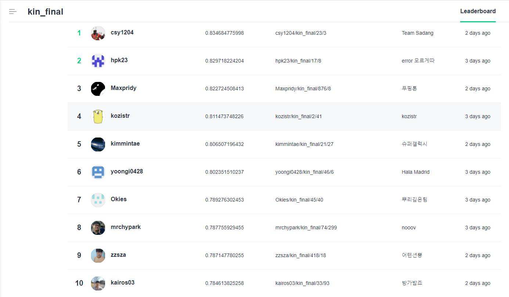
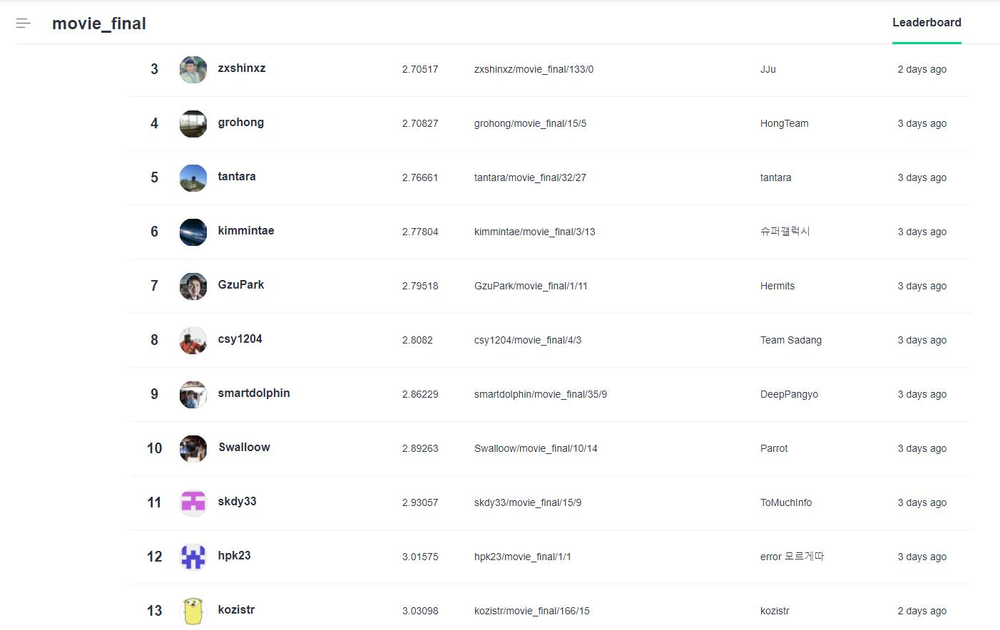

# [Naver AI Hackathon 2018](https://github.com/naver/ai-hackathon-2018)

### **Team kozistr - Member : 김형찬(kozistr)**

---

## tl;dr

I participated in [Naver A.I Hackathon 2018] and  
**ranked 4th/13th(over 200 teams total)** as an individual participant (Team : kozistr)

And also i uploaded **summary docs** with the codes.

### Final LeaderBoard

> 네이버 지식iN 질문 유사도 예측 (결선)

> 네이버 영화 평점 예측 (결선)

### Result

*Stage* | *Mission*    | *Metric* | *Score* | *Rank*
:-----: | :----------: | :------: | :-----: | :---:
phase 1 | kin          | acc      |         |
phase 1 | movie-review | mse      |         |
phase 2 | kin          | acc      |         |
phase 2 | movie-review | mse      |         |
 final  | kin          | acc      | 0.8115  | 4th
 final  | movie-review | mse      | 0.0310  | 13th

## Models

Soon~

## Hyper-Parameters

Soon~

## Summary

Here's summary docs!

## Author

HyeongChan Kim ([@kozistr](http://kozistr.tech))
